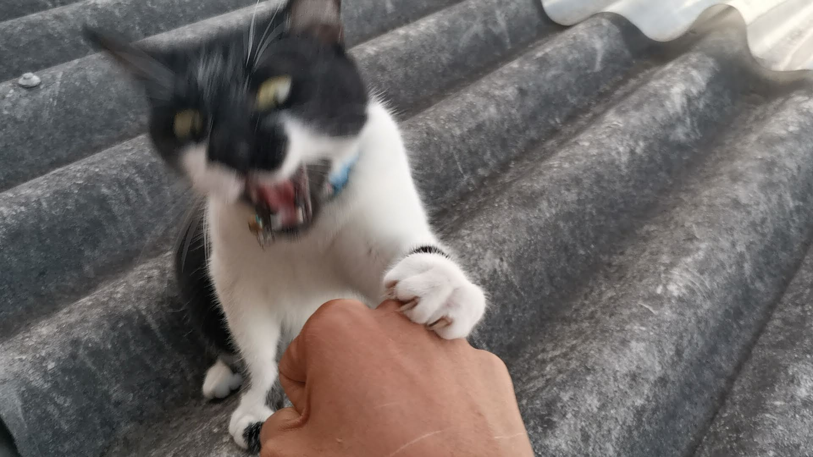
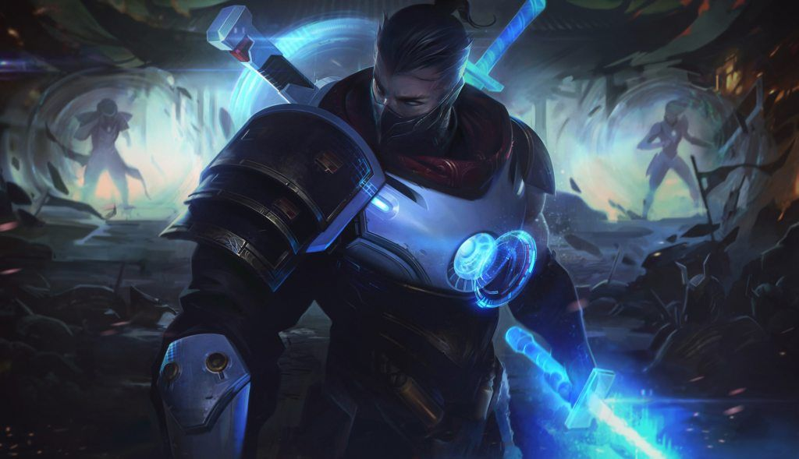

# Trabajo Final
## Descripción: En este repositorio se encontrará el proyecto final de la materia Lógica de Programación en el periodo 2021-1
### Integrantes:
* Julián Esteban Gómez López
* Andrés Felipe Saldarriaga Arias @MoreCodeLess
## Imagenes: 
Imagen subida por Julian: 

Imagen subida por Andrés: 

>>>>>>> b8252c38b8ba83d9a57081e50a1f25878166f40b
## Emojis: 
Primer Emoji Julian: 
:upside_down_face:
Primer Emoji Andrés:
:metal:

